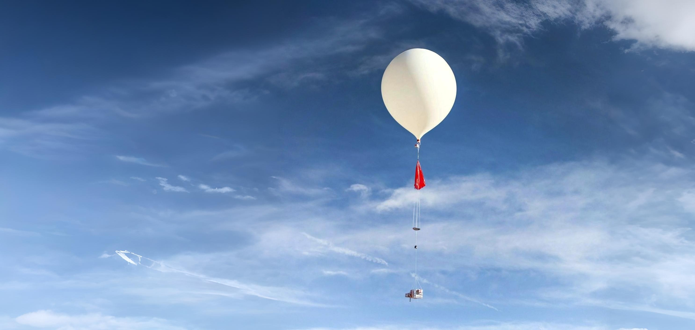

# Weather Balloon Codebase
This repository contains all the code for the various sensors integrating with the controller in the weather balloon payload of the Endeavor 1 mission.

## Payload Layout
The Raspberry Pi is the controller used for communication with the 5 attached sensors. A battery pack will be attached for powering the controller. Additionally, two cameras will be used for recording footage, and a gps module will be incorporated for tracking the location of the balloon at all times.

The sensors will be connected to the Raspberry through its pinout slots, and log data onto its internal storage (SD card)

## Sensors

### 1. Temperature and Humidity Sensor
The DHT11 Temp & Humidity sensor shall be used to monitor the temperature & humidity in the various levels of the atmosphere.

### 2. Pressure Sensor
As for pressure, the BMP280 barometric pressure sensor can be used not only to find out barometric conditions, but also, find out the altitude of the balloon, since the pressure decreases the higher you go in the atmosphere.

### 3. Ozone Sensor
The Gravity I2C Ozone sensor with a range of 0-10 ppm of Ozone (03) will be used to measure the varying presence of Ozone as we ascend through the atmosphere.

### 4. Geiger Counter
Geiger Counter modules for Arduino consist of a Miller GM tube, allowing us to measure radiation levels that increase in the high atmosphere due to a reduction in atmospheric density and thus the protection we receive from it.

### 5. Magnetometer
The HMC5883L Arduino-based 3-Axis Magnetometer is the most well-documented Magnetometer in the microcontroller world. It is relatively cheap and easy to work with. This sensor will allow us to measure variations in Earth’s magnetic field. 

## List of Parts

| Part Name | Approximate Cost (AED) |
| --------- | ---------------- |
| Raspberry Pi, upwards of a Model 3 | 350 AED |
| DHT11 Temperature Sensor | 20 AED |
| BMP280 Barometric Pressure Sensor | 30 AED |
| Arduino Miller Geiger Counter | 300 AED |
| HMC5883L Magnetometer  | 30 AED |
| Misc. Wires, connection | 20 AED |

## Other Critical Items
1. Battery
2. GPS
3. Space Cam x1
4. GoPro/360 Cam
